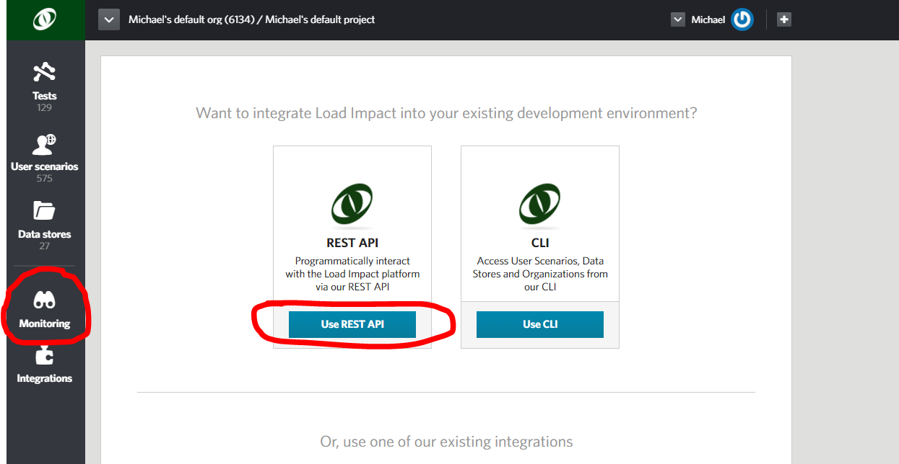
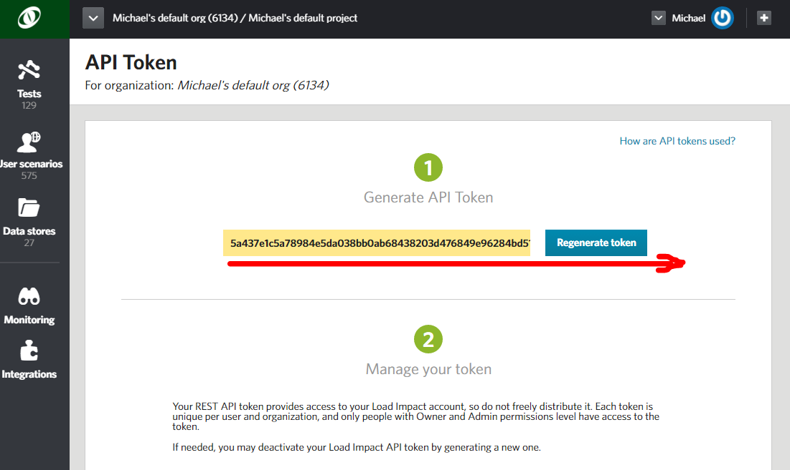
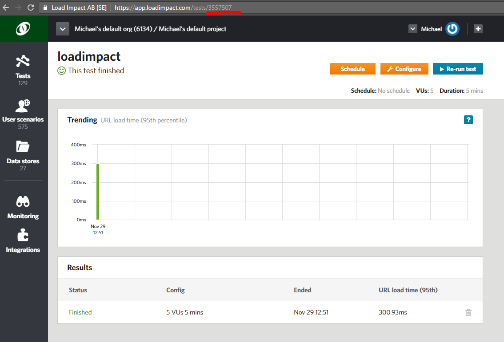

Automated Performance Testing with bash
=======================================

**bash**

Load Impact can be executed from any command line, continuous integration and delivery server. Using our robust and extensible APIs you can integrate Load Impact’s world-leading performance testing platform into your automated build and test process.

Load Impact covers your back with everything you need for Web, API and application performance testing. And test scripting is simple.

To get started, try this sample of how to include performance testing from your shell.

Continuous Delivery. Continuous performance feedback. Simple.
-------------------------------------------------------------

This sample assumes you are familiar with shell scripting in a \*nix environment, notably bash.

Is also assumes you have a Load Impact account. [If not, go get one – it’s free](http://loadimpact.com).

Set up your test
================

To execute Load Impact performance tests from a bash shell script some prerequisites are needed. They are curl, jq and bc for requests, json parsing and math respectively. If you’re on a Debian Linux derivative such as Ubuntu you can do sudo apt-get jq bc curl. Other variants have different package managers and installs.

The details are all in the Bash script for the execution so we will take a look at what it does in some detail.

You can get the code at github in the [loadimpact/genericbash](https://github.com/loadimpact/genericbash) repo where it is shared.

Integrate with the Load Impact API
==================================

Before we dive into the details – let’s get some essentials from your Load Impact account. We need the API key so you can access the API and a test to run.

The API key you get in your Load Impact account when you are logged in

Go to “Monitoring” on the left and click “Use REST API”.

Then copy it from the yellow text box.

Just note that the API token is *longer* than the size of the box so make sure you get all of it!

Now you need to know which test to run. You can list your test configurations using the API or the CLI if you want to but the simplest way is to open it directly in your account and copy the id from the URL. Underlined in red.

So now you have a test id for the test you want to run in your build pipeline and your API key.

All of the code is shared at Github for your download in the [loadimpact/genericbash](https://github.com/loadimpact/genericbash) repo!

3a Edit the script to set the test Id and the API key
=====================================================

The code has four parts, the initial and then three stages “Kickoff performance test”, “Performance test running” and “Show results”. If you are familiar with shell scripting you know the output from the execution is visible in the console window when you execute your build including the Load Impact performance test.

The initial part of the Bash code is where you set the test id and the API key.

So replace “YOUR\_TEST\_ID\_HERE” with your test id, keep the quotes, it’s Bash.

And replace “YOUR\_API\_KEY\_HERE” with your API key. Keep inside the quotes.

3b Kick off a performance test
==============================

We kick off the performance test by gluing together the URI for the [API to start the test](http://developers.loadimpact.com/api/#post-test-configs-id-start) and then output status messages to the console.

We use curl to make the API call to start the test and then specifically check for the expected 201 response.

If not there we will output message to the console about a build problem including an error text and exit the script.

If it is good, we parse the json response and extract the running test id.

Then we let it take a maximum of five minutes for the test to actually kickoff. Since it can take Load Impact a couple of minutes to acquire and allocate all the resources (mainly load agents) needed we take some time to let the test reach the status of “Running”. The bigger the test, the more resources needed and the longer it can take. But remember, it’s a couple of minutes.

We get that status of the test by [calling the API](http://developers.loadimpact.com/api/#get-tests-id) and parsing the json response to check for the status in the response.

The last thing we do is to output a message to the console that the test is running.

3c The test is running
======================

So now your Load Impact performance test is running!

This time we wait until the test has completed, reached the percentage completed value of 100% with a slightly longer sleep between refreshing status calls.

We do this by calling the [API for results](http://developers.loadimpact.com/api/#get-tests-id-results) and only requesting the percentage completed. The API returns all of the relevant data so we do some json parsing and just get the max percentage value from the result set.

All the results are available from the API so you can either use them or calculate new aggregate results to use as test thresholds for your pipeline test results.

We included an example of making a threshold from the [VU Load Time (please read the explanation of this value before using it)](http://support.loadimpact.com/knowledgebase/articles/174121-how-do-i-interpret-test-results).

We get the value by calling the same API as before but for the VU Load Time result, parse the json and get the max value by some jq magic.

If the value exceeds 1 second we exit the build step and fail the build by writing output to the console.

3d Show the results
===================

Finally, we show the results and output the max VU Load Time. It can of course be any result but as a sample. And of course we tack on a direct link to the full results and analysis in Load Impact.

Finally, executing the build.
=============================

Once started it will look something like the above.

There’s also a direct link to the full results and analysis in Load Impact where you can always find all the results of all your tests.

You can add/update/delete tests, user scenarios and data stores using the API and CLI, even stick all of it in your SCM of choice and let all of it be part of your build pipeline.

To dive deeper into using Load Impact from your CI/CD process (or for that matter any external usage) see our [*comprehensive API reference*](http://developers.loadimpact.com/api/) and the accompanying [*CLI*](http://support.loadimpact.com/knowledgebase/articles/833856-automating-load-testing-with-the-load-impact-api).

**Contact us today and we’ll throw in a free, one-hour consultation to help you get up and running quickly.**
